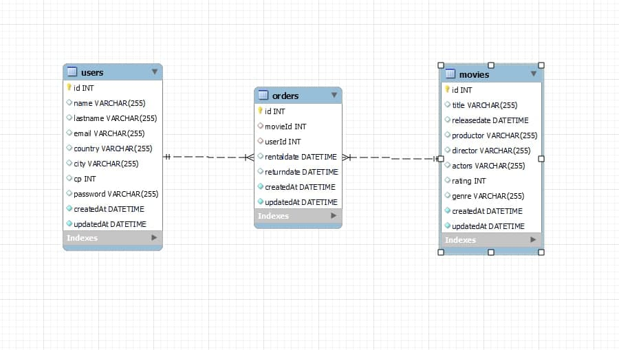
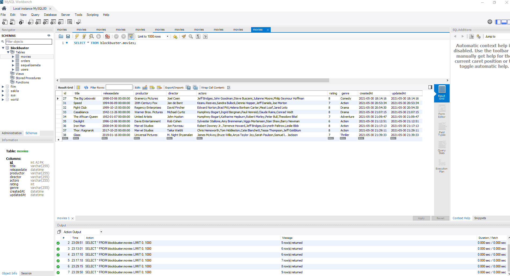

# TMDB TEST EXPRESS
 
 
### Project details
 
This is a team project. We have two objectives: learn how to do teamwork and start to work with endpoints. We use TMBD api to find some endpoints to work with. Then we have to verify our code with Postman app. 
 
- Start date: 25 May 2021
- Delivery date: 30 May 2021
- Dedicated time: <30 hours 

 
 
 

 
 
 
## Tech
 
- JAVASCRIPT
- POSTMAN
- SEQUELIZE
- MYSQL WORKBENCH
 
 

 
## Intructions
Anybody: Anybody can use that commands 
Sign up users: You need to sign up to use that commands 
Admin: You need to be Admin to use that commands but you can use all sign up users commands too

## Commands 
 
### ANYBODY
 
GET Allmovies
- movies/allmovies
 
GET To search by title
- movies/bytitle/:title
 
GET To search by id
- movies/byid/:id
 
GET To search by genre
- movies/bygenre/:genre
 
GET To search by actor
- movies/byactor/:actor
 
GET To search by movies are in theathers right now
- movies/nowplaying
 
GET To search by popularity
- movies/popular
    
#### NEW USER
 
POST Create new user 
- /users
- Body attributes: mame, lastname, email, country, city, cp, password
 
POST Login
- /login
- Body attributes: email, password
    
### ADMIN
 
GET All orders
- /orders
 
GET All users
- /users/allUsers
 
POST Orders by city
- /orders/bycity
- Body attributes: city
 
POST Find user by name
- users/byname
- Body attributes: name
 
POST Create movie
- movies/createmovie
- Body attributes: title
 
DEL Delete movie
- movies/deletemovie
- Body attributes: title
    
### SIGN UP USERS
 
POST Find users by email
- users/byemail
- Body attributes: email
 
DEL Delete user by id
- users/delete
- Body attributes: id
 
POST New order
- orders/neworder
- Body attributes: movieId, userId, rentaldate, returndate
 
PUT Update order
- orders/modify
- Body attributes: movieId, userId, rentaldate, returndate
 
POST Orders by user id
- orders/orderuserid
- Body attributes: id
 
DEL Delete order
- orders/delete
- Body attributes: orderid
    

