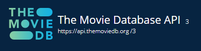

#TMDB TEST EXPRESS
 
 
### Project details
 
This is a team project. We have two objectives: learn how to do teamwork and start to work with endpoints. We use TMBD api to find some endpoints to work with. Then we have to verify our code with Postman app. 
 
- Start date: 18 May 2021
- Delivery date: 23 May 2021
- Dedicated time: <15 hours 

 
 
 

 
 
 
## Tech

- JAVASCRIPT
- POSTMAN
 
 

## Commands to search

### MOVIES
 
To search by title
- movies/bytitle/:thetitle
 
To search toprated
- movies/toprated
 
To search by title id
- movies/searchid/:theid
 
To find all genre ids
- movies/findallgenreid
 
To search by genre name
- movies/searchgenre/thegenrename
 
To search by genre id
- movies/scode/thegenreid
 
To search by movies are in theathers right now
- movies/nowplaying
 
To search by popularity
- movies/popular
 
 
 
 
### TV SHOWS
 
To search by title
- series/bytitle/:thetitle
 
To search by id
- series/searchid/:theid
 
To search by toprated
- series/toprated
 
To search by tv on the air
- series/ontheair
 
To search tv show are in theathers by id
- series/intheaters/:theid
 
To search popular tv shows in the actual moment
- series/popularTV
 
    

